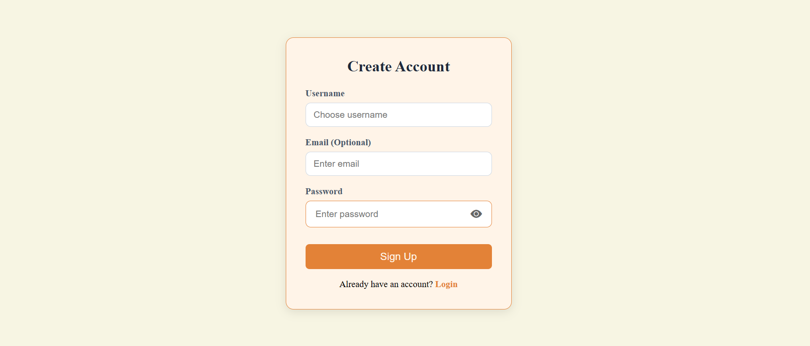
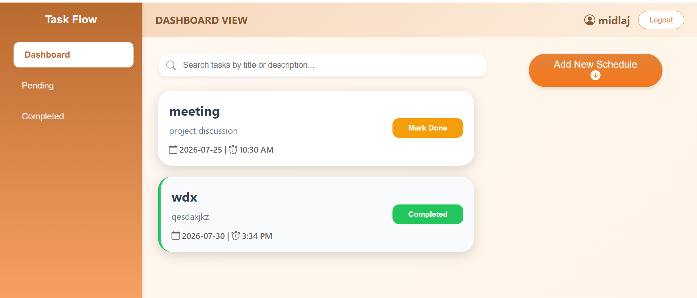
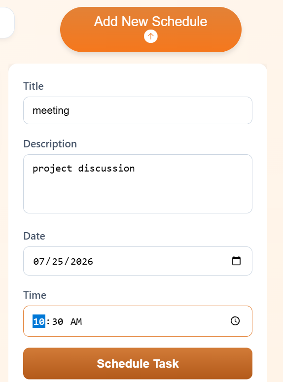
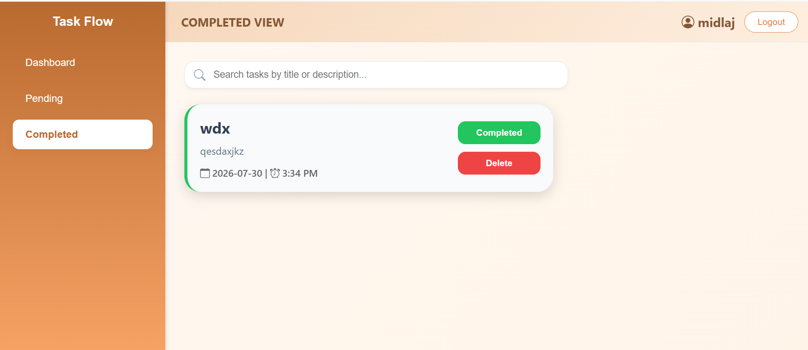
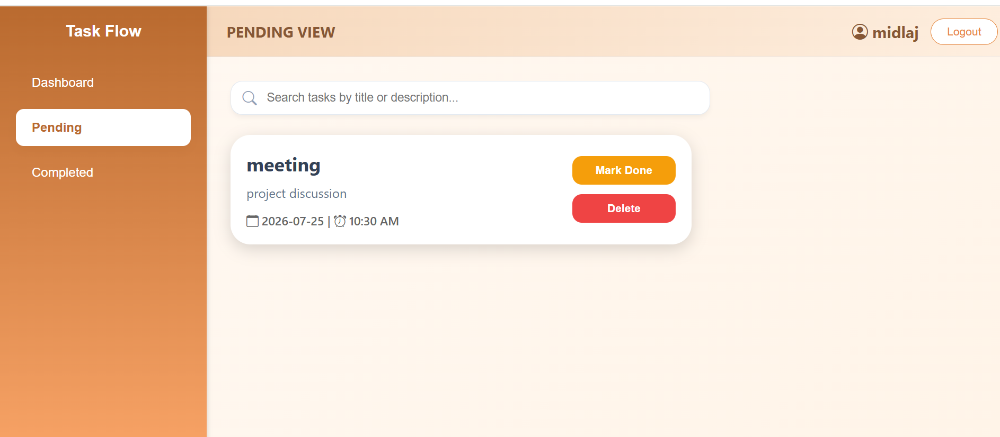
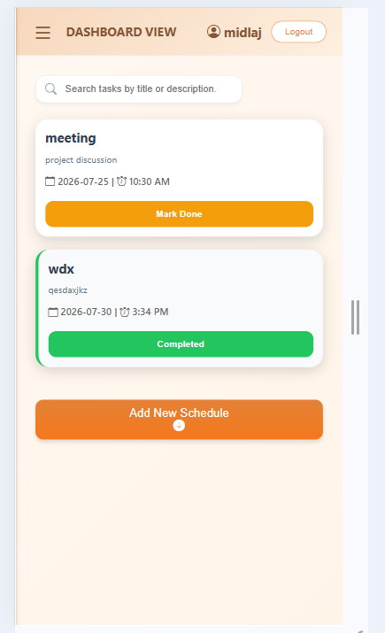
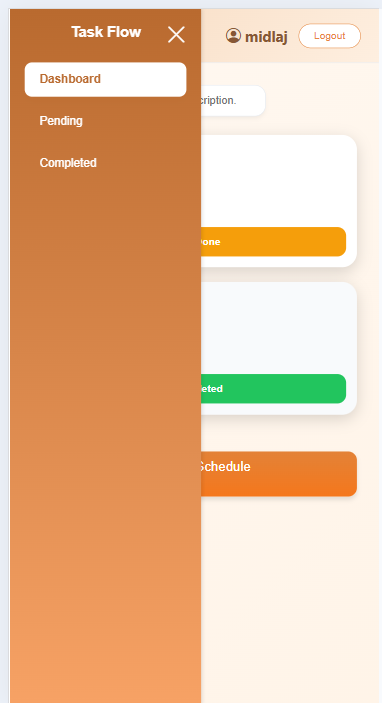

# Task Flow - Schedule Manager

A modern Full-Stack Task Management application built with **React.js** and **Django REST Framework**. Task Flow helps users organize daily schedules by creating, managing, searching, filtering, and tracking tasks through a clean and responsive interface.

---


### Authentication
- User Registration (Sign Up)
- Secure Login
- Token-based Authentication
- Protected Dashboard Routes

### Task Management
- Create new tasks
- View all tasks
- Delete tasks
- Mark tasks as Completed or Pending

### Search & Filter
- Search tasks by title or description
- Filter tasks by:
  - Dashboard (All)
  - Pending
  - Completed

### User Interface
- Responsive Design
- Modern Dashboard
- Sliding Sidebar
- Custom Confirmation Modal
- Custom Toast Notifications
- Password Show/Hide Toggle
- Clean and User-Friendly Design

### Time Management
- 12-hour AM/PM time format
- Task scheduling with date and time

---


## Frontend
- React.js
- React Router
- CSS3
- Bootstrap Icons

## Backend
- Python
- Django
- Django REST Framework
- Token Authentication

## Database
- SQLite3

---

# Project Structure

```text
project1/
│
├── frontend/
│   ├── src/
│   │   ├── components/
│   │   │   ├── Login.jsx
│   │   │   ├── Signup.jsx
│   │   │   ├── TaskForm.jsx
│   │   │   ├── TaskCard.jsx
│   │   │   
│   │   ├── pages/
│   │   │   └── Dashboard.jsx
│   │   ├── App.jsx
│   │   ├── main.jsx
│   │   └── index.css
│   └── package.json
│
├── backend/
│   ├── project1/      
│   ├── app1/          
│   ├── manage.py
│   └── requirements.txt
│
├── README.md
```

---

#  Installation

### 1. Clone the Repository

```bash
git clone https://github.com/midlaj-vp/Schedule-Manager.git
```


The backend will start at:

```text
http://127.0.0.1:8000/
```

---

## API Base URL

```text
http://127.0.0.1:8000/api/
```

## Clone the repository

```bash
git clone https://github.com/midlaj-vp/Schedule-Manager.git
```

## Frontend

```bash
cd frontend
npm install
npm run dev
```

## Backend

```bash
cd backend
python -m venv venv
```

### Windows

```bash
venv\Scripts\activate
```

### Linux / macOS

```bash
source venv/bin/activate
```

Install dependencies

```bash
pip install -r requirements.txt
```

Apply migrations

```bash
python manage.py migrate
```

Run the server

```bash
python manage.py runserver
```

---

# Screenshots

Add screenshots of:

- Login Page([alt text](Login-1.png))
- Signup Page()
- Dashboard ()
- card()
- completed()
- pending ()
- Mobile View ()()

---
## Live Demo

Coming Soon...

# Author

**Muhammed Midlaj**

Python Full Stack Developer

